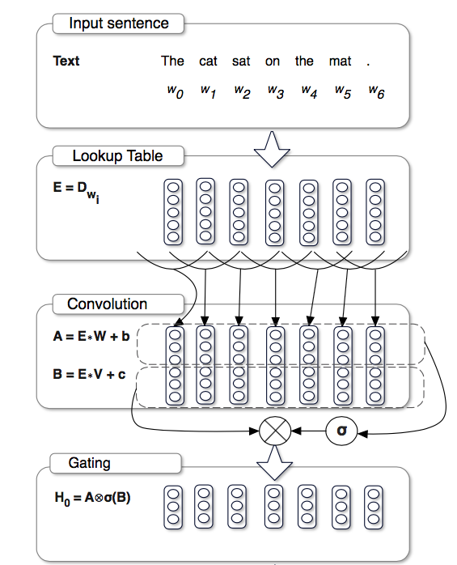
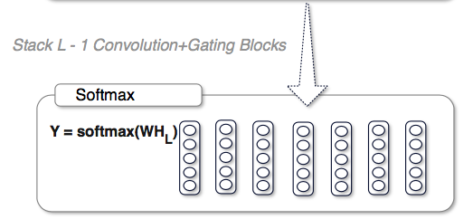
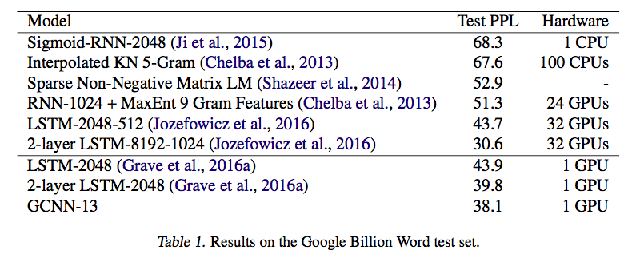
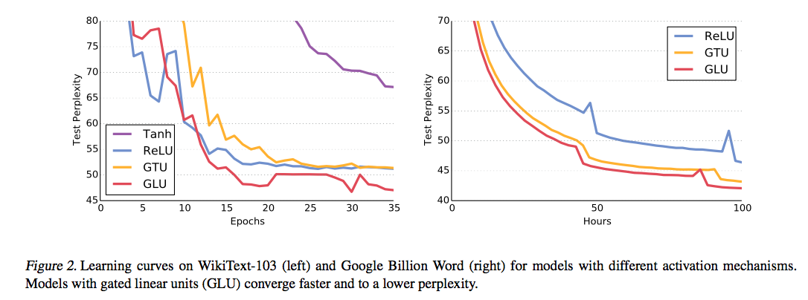
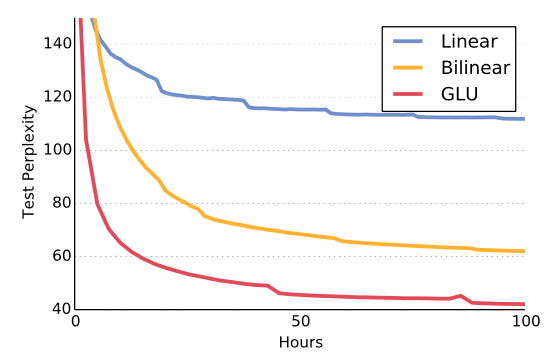
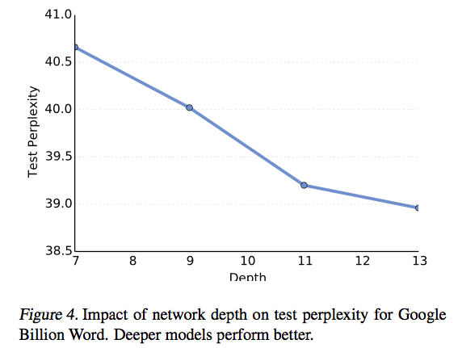
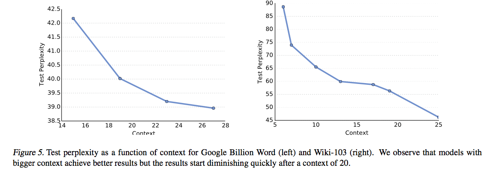
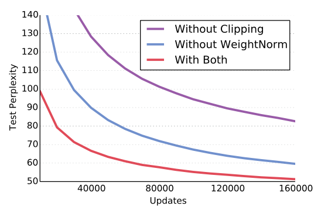

# Gated Convolutional Networks

本文是参考文献[1]的笔记。

长期以来，基于LSTM的深度学习算法由于可以对任意长度的上下文进行建模而盘踞在自然语言处理界的山顶。卷积神经网络虽然蠢蠢欲动，却始终不得其法。

而今，这个在CV上嚣张拨扈的东西终于把手伸到了NLP界，而且是在最basic的语言模型问题上。

# 语言模型

所谓的语言模型，即是指在得知前面的若干个单词的时候，下一个位置上出现的某个单词的概率。

最朴素的方法是N-gram语言模型，即当前位置只和前面N个位置的单词相关。如此，问题便是，N小了，语言模型的表达能力不够。N大了，遇到稀疏性问题，无法有效的表征上下文。

LSTM模型一般会将单词embedding到连续空间，然后输入进LSTM，从而有效的表征上下文。但LSTM的问题在于，作为递归模型，当前状态依赖于上一状态，并行化受到限制。

# 门限卷积

所谓的门限卷积，其核心在于为卷积的激活值添加一个门限开关，来决定其有多大的概率传到下一层去。下面一步步对上图进行解析。

首先，将单词embedding到连续空间；即上图中的第二部分Lookup Table。这样，单词序列就能表现为矩阵了。

然后就是卷积单元了（上图中的第三部分），与普通卷积不同，门限卷积在这里分为两部分，一部分是卷积激活值，即B，该处于普通卷积的不同在于没有用Tanh，而是直接线性。另一部分是门限值，即A，A也是直接线性得到，但会经过一个sigmoid运算符。

之后就是门限单元，A和B进行element-wise的相乘，得到卷积后的结果。卷积单元和门限单元加起来形成一个卷积层。

经过多个这样的卷积层之后，再将其输入到SoftMax中，得到最后的预测。

## 细节

在做卷积层的时候，需要不让第i个输出值看到i以后的输入值。这是由语言模型的特性决定的，需要用i之前的信息来预测i。为了达到这样的效果，需要将输入层进行偏移，偏移k/2个单位，其中k是卷积的宽度，偏移后开头空缺的部分就用0进行padding。

由于residual network的强大能力，在真正的实现里，会把卷积单元和门限单元包在一个residual block里。

在最后的softmax层，普通的softmax会因为词表巨大而非常低效。因而选用adaptive softmax。adaptive softmax可以为高频词分配更多的空间而给低频次分配比较少的空间。

# 门限机制

LSTM中有input门和forget门两种，这两种缺一则会导致有些信息的缺失。而卷积中，经过实验，不需要forget gate。

而LSTM中使用的input门，如上。这种在卷积上却容易导致vanishing问题。因为tanh‘和σ’都是小于1的值。

因而，在卷积上，使用：

该方法存在一路使得X的导数可以不被downscale的传下去。

# 实验

## Setup

- 使用Google Billion Word和WikiText-103两种数据集。
- 使用perplexity来进行衡量结果。	
- 使用Nesterov's momentum算法来训练，momentum设为0.99。
- weight normalization.
- gradient clipping to 0.1
- 使用Kaiming initialization
- learning rate 从[1., 2.]中uniformly选取

## 效果测试

单GPU上效果最好。

## 性能测试

Throughput是指在并行化条件下最大输出。
Responsiveness是指序列化的处理输入。
由表可知，CNN本身的处理速度非常快。而LSTM在并行化后也能拥有很高的速度。究其原因，是在cuDNN中对LSTM有特别的优化，而对1-D convolution却没有。但即便如此，CNN仍然完胜。

## 不同门限测试

- GTU: tanh(X\*W+b)⊗σ(X\*V+c)
- GLU: (X\*W+b)⊗σ(X\*V+c)
- ReLU: X⊗(X>0)
- Tanh: tanh(X\*W+b)

## 非线性模型测试

上一个实验证明了Gated linear unit深受Linear unit的好处。这里评测一下GLU和纯线性模型的比较。

- Bilinear: (X\*W+b)⊗(X\*V+c)

纯Linear模型同5-gram模型效果类似。

## 模型深度测试

## Context Size测试

## 训练测试

# 参考文献

1. Dauphin Y N, Fan A, Auli M, et al. Language Modeling with Gated Convolutional Networks[J]. arXiv preprint arXiv:1612.08083, 2016.

