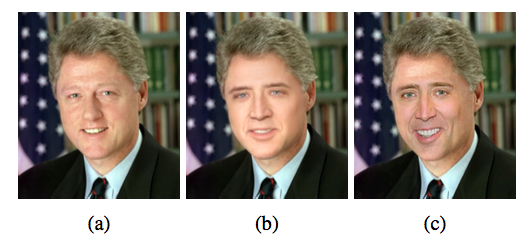
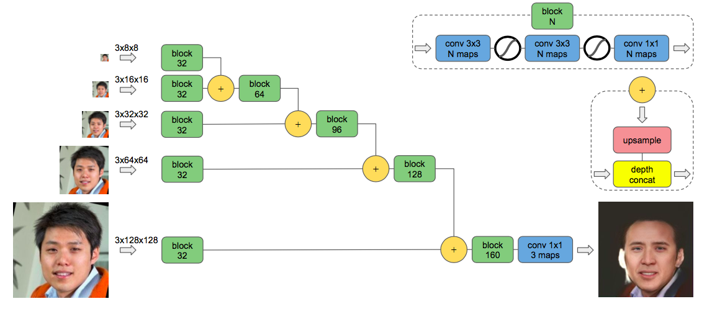
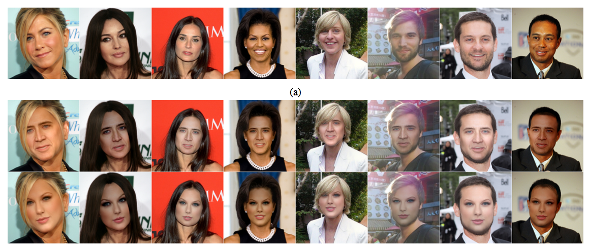
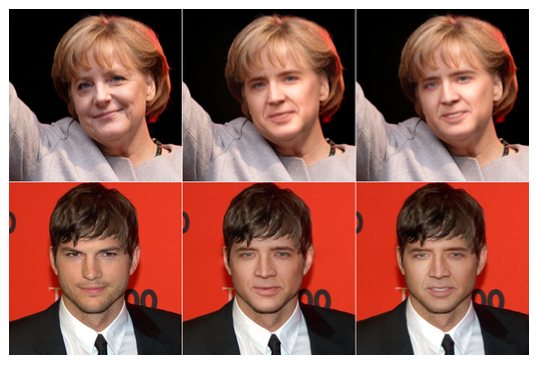

# 卷积“换脸”

图像风格转换[1][2][3]在效果上的成功，使得研究者们开始拓展它的应用范围，换脸就是其中之一。在图像风格转换算法框架下，如果将风格图像换做目标人脸，那么就有可能将图像中的人脸换掉。

由于图像风格转换的算法框架下是语义级别的图像内容操作，因而，在图像风格转换框架下的换脸可以达到原图的表情、肤色、光照不变。

上图中，a是原图，b是由本文描述的算法得到的结果，c是直接使用图像编辑软件得到的结果。

本文的算法来源于参考文献[4].下面将对算法细节进行进行描述。

# 算法细节

## 图像预处理

想要进行换脸操作，首先要将脸的位置对齐，这个步骤使用两种技术，人脸对齐和背景切分。对齐使用如下步骤：

- 获取原图和目标图中人脸的68个关键点
- 通过对这68个关键点进行线性变换，将原图中的人脸摆正。
- 通过对这68个关键点进行匹配，将目标图中的人脸映射到原图中人脸的位置。
- 将原图中的人脸与背景切分，以方便后续只对人脸区域进行操作。

## 网络结构

延循之前的算法框架，本算法采用一种多尺寸结构，小尺寸的图像经过卷积后自动上采样为2倍大小，然后再和大尺寸的图像进行通道连接。

> 没去看之前的算法框架为何要采用这样的方式，但个人推测是为了保证分辨率，因为在低分辨率的图像上容易训练。

## 损失函数

### 内容损失

同[1][2][3]类似，图像的损失函数是基于一个已经训练好的神经网络里的feature_map。类似的，内容损失函数为：

### 风格损失

针对人脸问题，风格损失函数做了一些修改，因为Gram Matrix不能够捕捉到图像中的结构信息，因而在人脸问题上不能应用，所以，本文使用[3]中的最近邻方法，即原图中的某个位置的图像用目标图中最相似的片段进行替换。

但同[3]不同的是，[3]中对于原图中的某个patch，搜索域是全局域，即在全局域去寻找相似patch，而本文算法则根据从人脸中提取的关键点来对搜索域进行限制。即对输入图像的人脸的某个部分，只在目标图中的某个部分附近进行相似patch搜索。

本算法还有一个要求：需要目标人脸的多张图像，即多张风格图像。在相似patch搜索时，损失在图像区域上有所限制，但是可以在多张图像提取的patch上进行搜索，这样，可以保证能够复现多种多样的表情。

所以，风格损失函数为：

### 光照损失

上述两种损失函数都是依赖于从训练好的VGG网络中提取的特征图，而VGG网络是针对分类训练的网络，并不能特定的提取光照特征。

为了保持换脸过程中光照保持不变，那么需要对光照上的变换进行惩罚。而为了提取光照变化，算法针对光照训练了一个CNN分类器，针对两张除了光照外其他都不变的图像，分类器判断这一对图像是否发生了光照变换。

使用从这个网络中得到的feature map进行光照损失的计算

### 平滑损失

与其他类似，

### 损失函数

综上所述，损失函数为

# 效果

在本算法框架下，针对每一个目标人脸，都需要一个网络。训练了两个网络，一个是Nicolas Cage，另一个是Taylor Swift。

## 正脸的作用

对比了各种角度人脸的替换结果

越是正脸，就越像Cage，原因可能是数据的不均衡性导致的，因为目标图像中侧脸比较少。

## 光照损失的作用

左中右分别为，原图，带光照损失的换脸和不带光照损失的换脸。

## 风格损失权重的作用

左中右分别为，原图，风格损失权重=80，风格损失权重=120。

## 错误示例

左中，遮挡物被去掉了，说明算法不支持遮挡物
右，效果差，因为不是正脸，且pose比较少见。

# 总结

可提升之处：

- 生成图像的质量来源于目标图像的丰富性。侧脸的差效果可能是因为目标图像中侧脸的图像少的缘故。增加目标图像的丰富程度可以提升效果
- 一些图像看起来被过度平滑了，添加GAN损失可能能解决这个问题。
- 修改损失函数使遮挡物可以保存下来。
- 增强人脸关键点检测算法。
- 使用VGG-Face网络来进行内容损失和风格损失的计算。

# 参考文献

- [1]. [图像风格转换](http://blog.csdn.net/stdcoutzyx/article/details/53771471)
- [2]. [感知损失](http://blog.csdn.net/stdcoutzyx/article/details/54025243)
- [3]. [MRF和CNN的图像生成](http://blog.csdn.net/stdcoutzyx/article/details/54173846)
- [4].Korshunova I, Shi W, Dambre J, et al. Fast Face-swap Using Convolutional Neural Networks[J]. arXiv preprint arXiv:1611.09577, 2016.