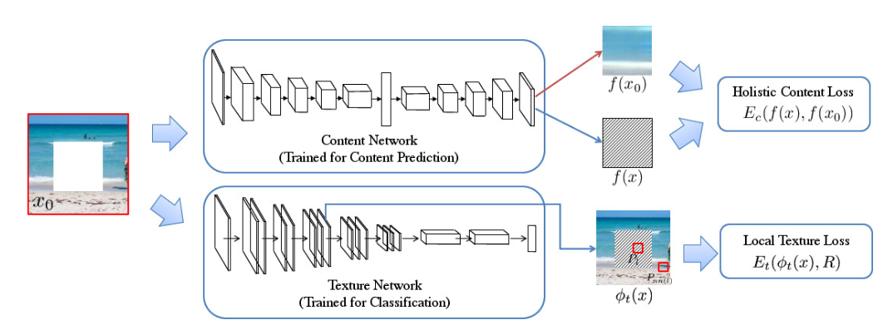

# 深度学习之图像修复

图像修复问题就是还原图像中缺失的部分。基于图像中已有信息，去还原图像中的缺失部分。

从直观上看，这个问题能否解决是看情况的，还原的关键在于剩余信息的使用，剩余信息中如果存在有缺失部分信息的patch，那么剩下的问题就是从剩余信息中判断缺失部分与哪一部分相似。而这，就是现在比较流行的PatchMatch的基本思想。

CNN出现以来，有若干比较重要的进展：

- 被证明有能力在CNN的高层捕捉到图像的抽象信息。
- [Perceptual Loss](http://blog.csdn.net/stdcoutzyx/article/details/54025243)的出现证明了一个训练好的CNN网络的feature map可以很好的作为图像生成中的损失函数的辅助工具。
- [GAN](http://blog.csdn.net/stdcoutzyx/article/details/53151038)可以利用监督学习来强化生成网络的效果。其效果的原因虽然还不具可解释性，但是可以理解为可以以一种不直接的方式使生成网络学习到规律。

基于上述三个进展，参考文献[1]提出了一种基于CNN的图像复原方法。

# CNN网络结构

该算法需要使用两个网络，一个是内容生成网络，另一个是纹理生成网络。内容生成网络直接用于生成图像，推断缺失部分可能的内容。纹理生成网络用于增强内容网络的产出的纹理，具体则为将生成的补全图像和原始无缺失图像输入进纹理生成网络，在某一层feature_map上计算损失，记为Loss NN。

内容生成网络需要使用自己的数据进行训练，而纹理生成网络则使用已经训练好的VGG Net。这样，生成图像可以分为如下几个步骤：

定义缺失了某个部分的图像为x0

- x0输入进内容生成网络得到生成图片x
- x作为最后生成图像的初始值
- 保持纹理生成网络的参数不变，使用Loss NN对x进行梯度下降，得到最后的结果。

关于内容生成网络的训练和Loss NN的定义，下面会一一解释

## 内容生成网络

生成网络结构如上，其损失函数使用了L2损失和对抗损失的组合。所谓的对抗损失是来源于[对抗神经网络](http://blog.csdn.net/stdcoutzyx/article/details/53151038).

在该生成网络中，为了是训练稳定，做了两个改变：

- 将所有的ReLU/leaky-ReLU都替换为ELU层
- 使用fully-connected layer替代chnnel-wise的全连接网络。

## 纹理生成网络

纹理生成网络的Loss NN如下：

它分为三个部分，即Pixel-wise的欧式距离，基于已训练好纹理网络的feature layer的perceptual loss，和用于平滑的TV Loss。

α和β都是5e-6，

Pixel-wise的欧氏距离如下：

TV Loss如下：

Perceptual Loss的计算比较复杂，这里利用了PatchMatch的信息，即为缺失部分找到最近似的Patch，为了达到这一点，将缺失部分分为很多个固定大小的patch作为query，也将已有的部分分为同样固定大小的patch，生成dataset PATCHES，在匹配query和PATCHES中最近patch的时候，需要在纹理生成网络中的某个layer的激活值上计算距离而不是计算像素距离。

但是，寻找最近邻Patch这个操作似乎是不可计算导数的，如何破解这一点呢？同[MRF+CNN](http://blog.csdn.net/stdcoutzyx/article/details/54173846)类似，在这里，先将PATCHES中的各个patch的的feature_map抽取出来，将其组合成为一个新的卷积层，然后得到query的feature map后输入到这个卷积层中，最相似的patch将获得最大的激活值，所以将其再输入到一个max-pooling层中，得到这个最大值。这样，就可以反向传播了。

## 高清图像上的应用

本算法直接应用到高清图像上时效果并不好，所以，为了更好的初始化，使用了Stack迭代算法。即先将高清图像down-scale到若干级别[1,2,3,...,S]，其中S级别为原图本身，然后在级别1上使用图像均值初始化缺失部分，得到修复后的结果，再用这个结果，初始化下一级别的输入。以此类推。

# 效果

上图从上往下一次为，有缺失的原图，PatchMatch算法，Context Decoder算法（GAN+L2)和本算法。

## 内容生成网络的作用

起到了内容限制的作用，上图比较了有内容生成网络和没有内容生成网络的区别，有的可以在内容上更加符合原图。

## 应用

图像的语义编辑，从左到右依次为原图，扣掉某部分的原图，PatchMatch结果，和本算法结果。

可知，该方法虽然不可以复原真实的图像，但却可以补全成一张完整的图像。这样，当拍照中有不想干的物体或人进入到摄像头中时，依然可以将照片修复成一张完整的照片。

# 总结

CNN的大发展，图像越来越能够变得语义化了。有了以上的图像复原的基础，尽可以进行发挥自己的想象，譬如：在图像上加一个东西，但是光照和颜色等缺明显不搭，可以用纹理网络进行修复。

该方法的缺点也是很明显：

- 性能和内存问题
- 只用了图片内的patch，而没有用到整个数据集中的数据。

## 参考文献

[1]. Yang C, Lu X, Lin Z, et al. High-Resolution Image Inpainting using Multi-Scale Neural Patch Synthesis[J]. arXiv preprint arXiv:1611.09969, 2016.