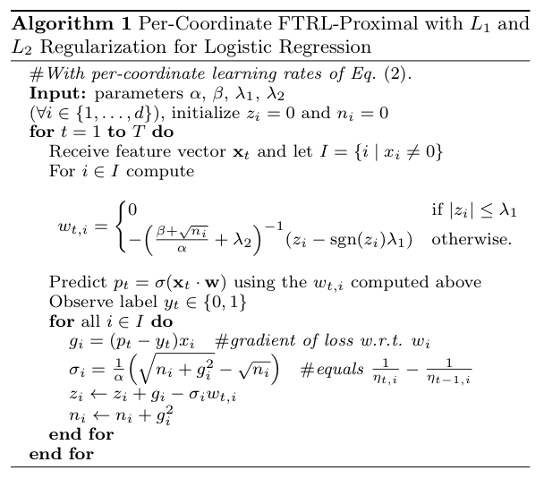
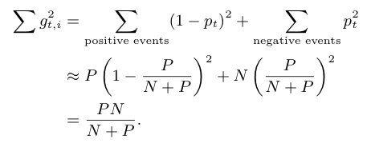
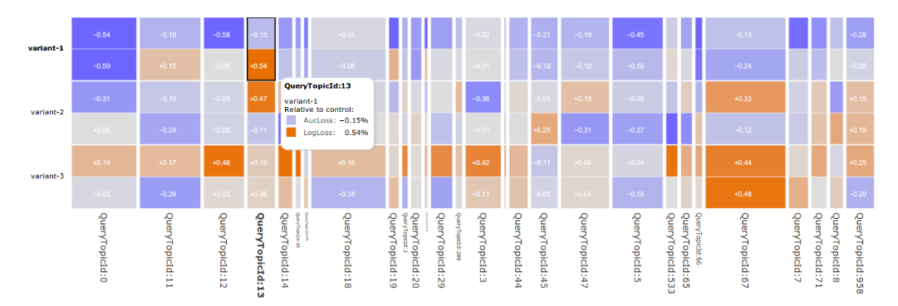
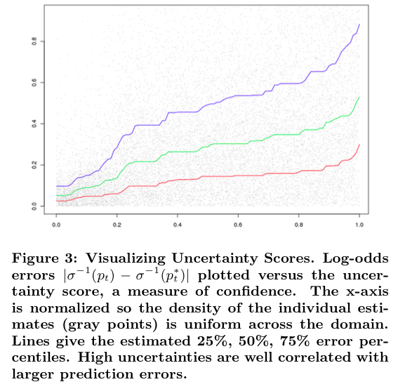

# Google广告点击预估

本文是Google 2013年在KDD上发表论文的笔记，这是一篇将已有的学术研究成果进行大规模实践检测其是否有效的论文，是一篇实用性大于研究性的论文，相信偏向机器学习应用的同学能从这篇论文中受益匪浅，特将此论文进行总结，记录笔记，以供后面使用的时候查询。

# 内容概览

这篇论文涉及的方面主要包括三部分：

- 第一部分是学术成果的应用，包括：

	- FTRL-Proximal 在线学习算法（拥有很好的稀疏和收敛性质）
	- per-coordinate 学习速率

- 第二部分是工程性上的小trick，包括：

	- 节省内存
	- 性能评估和可视化方法
	- 预估概率的置信估计
	- 校准方法
	- 特征自动管理

- 第三部分是没有用的尝试，包括：
	
	- Aggressive Feature Hashing
	- Dropout
	- Feature bagging
	- Feature Normalization
	
# 引入

什么是点击预估？在搜索引擎中，当搜索一个query时，会通过advertiser-chosen keywords触发一些候选广告列表。那么，此时就需要系统来决定什么广告该被展现给用户，以什么样的顺序，用户点击后又要如何付费等等。

在解决上述问题的过程中，一个重要的环节就是对用户是否对广告进行点击进行估计，即求出 `P(click|q, a)`.

为了预估这个概率，需要抽取一系列的特征，包括query, ad creative, various ad-related metadata。抽取完特征后，特征的维度会灰常之大，所以常用LR进行预估，使用OGD(Online Gradient Descending)方法进行学习。

# 在线学习和稀疏化

原本，使用OGD就可以训练LR了，但因为样本维度太高，导致最后生成的模型太大，为了降低模型尺寸，需要一种方法，既可以使训练出来的参数够稀疏，又要保证效果。

为了解决这一问题，学术界想出了无数办法，包括L1正则化、截断、FOBOS、RDA等方法，事实证明，RDA在稀疏性上做的最好，而OGD则效果最优。为了综合两者之长，FTRL-Proximal横空出世。关于这一段的历史，可以参见参考文献2-6.

OGD的参数更新公式为：

FTRL-Proximal与OGD的更新规则不同，是：

而FTRL-Proximal的一个算法实现如下：

当然，上述伪代码不仅有FTRL的实现，还包含了`per-coordinate`学习速率设置。

FTRL与其他方法的对比结果如下：

可以发现，FTRL在稀疏度和效果上面全面碾压RDA。

# Per-Coordinate Learning Rates

OGD标准的方法是有一个全局的学习速率，但在离散LR中，各个特征出现的次数是不一样的，有些特征出现的次数多，有些少。所以，Per-Coordinate的方式就是对每个不同的特征，根据该特征在样本中出现的次数来推算它的学习率。更具体一些的解释就是，一个特征，如果出现的次数多，那么模型在该特征上学到的参数就已经比较可信了，所以学习率可以不用那么高；而对于出现次数少的特征，认为在这个特征上的参数还没有学完全，所以要保持较高的学习率来使之尽快适应新的数据。一个可能的学习率计算方法如下。

即步长等于历次梯度的平方和的开方的倒数

使用Per-Coordinate Learning Rates可以使AucLoss降低11.2%，注意，在广告场景下，1%都已经算是很大的提升了。

# 节省内存

## Probabilistic Feature Inclusion

在广告点击预估场景下，是特别特别高维的数据，在这种数据中，很大一部分特征是只出现一次的，此时，如果想要降低模型的尺寸，即减少模型中特征的数目。

直观上看，我们应该先读取一遍数据，然后把出现次数小于k次的特征删掉，但显然，这种方式对于online learning很有问题，而且将数据读取两遍也是极耗时间的。不可行。

第二种方法是使用L1-regularization类的方法来保证稀疏性，这些方法在上面已经提过，FTRL-proximal方法最好，但是FTRL-proximal方法仍然需要追踪过多的特征。还需要其他的办法减少特征数目。

第三种方法是概率法，使用随机的方式将特征添加进模型，有两种代表性的方法。

- Poisson Inclusion，这种方法，对每个特征，如果它没在模型中出现过，那么以概率p将其加入到模型中。直观上，这种方法就会将出现次数多的特征加入到模型中。
- Bloom Filter Inclusion, 使用counting Bloom filter来对特征进行检测，如果一个特征出现了超过n次，那么就将该特征添加进模型

两种方法都能在AucLoss降低较小的情况下很大的降低内存，具体评测如下：

## Encoding Values with Fewer Bits

对于OGD来说，使用32位或者64位的浮点数真是太奢侈了，因为训练好的模型中，绝大部分的参数的区间是在[-2,2]中的。所以，为了节省内存，使用q2.13的encode方法。

在这种方法中，1bit用来表示正负， 2bit用来表示整数部分，13bit用来表示小数部分，一共16bit。

实验表明，相对于64bit浮点数来说，使用q2.13浮点编码方法可以只使用25%的内存，而AucLoss几乎没有变化。

## Training Many Similar Models

在现实场景中，经常需要去测各种不同变种的模型，这些模型之间往往可以share很多东西，如果每个变种都训练一个单独的模型的话，耗时好资源，不划算。

前人有工作来解决这个问题，方法就是，使用一个固定的模型作为先验，然后使用变种模型去预测残差。这种方法很直观，但是却不能用来评测feature removal和feature alternate。

论文中的方法，基于这样一个观察结果，即每一维的特征都跟特定的数据有关，每个模型的变种都有自己独特的数据，因而，可以用一张hash表来存储所有变种的模型参数。但需要维护一个该特征是哪个变种模型的key。

对某些变种模型，如果它没有某个特征，那么在该特征上的梯度就是0， 这样做会浪费一定的空间，但是鉴于我们只把很相似的模型在一起训练，这样的损失还是可以承受的。

## A single Value Structure

有些时候，模型变种仅仅是添加一些特征和删除一些特征，那么此时，可以采用更加激进的方法，即共享特征只保留一个，而不是每个模型变种都保存一个。在具体实现中，用一个位数组来记录某个特征被那些模型变种共享。更新参数的时候，则对一个样本，计算出多个损失和更新值，然后对一个特征，使用共享该特征的所有模型变种的更新值的平均值来进行更新。

## Computing Learning Rates with Counts

针对Per-Coordinate中的步长计算方法，使用记录count的方法来模拟梯度的平方和。此时，需要记录下正例的数目和反例的数目。假设，模型准确的学到了概率，那么用下面的公式去模拟(不知道为啥)

这种近似是放的太宽，但是anyway， works well.

## SubSampling Training Data

为了节省内存，可以降低数据量，因为点击率预估的数据是偏斜的，有点击的数据大约占10%左右。所以，可以将负样本进行加权，然后在训练的时候，给负样本增加权重。比如，以r的概率抽取负样本，那么，负样本的概率可以加权为r的倒数。

# 评测模型

## Progressive Validation

普通的方法就是从训练集中划分出一个hold-out测试集出来进行评测。当这样的方法不如progressive validation, 何为progressive validation？ 就是online test.

online test的好处就是可以用100%的数据做测试集和训练集。这样就使得评测出的结果是基于比较大的数据上的，更有说服力。还可以在一些特征的sub-slice数据上进行评测，比如单独的一个国家的数据，单独的某个topic的数据。

评测指标的绝对值往往会误导大家，因为指标在不同的国家，不同的query上，不同的时间是不同的。因而更需要关注相对变化，即与基线模型的比较。

## Deep Understanding through Visualization

在真实场景下，往往总体效果的提升来源于某一个领域的数据的预测变好了，并不能说在所有数据上都变好。为了更加深刻的理解这种现象，文章开发了一个web可视化工具，GridViz，用来查看不同领域的点击率的预估结果，当然，因为划分数据的方法有千万种，所以GridViz还具有交互功能，下图就是一个样例：

# Confidence Estimates

在很多应用中，只预测广告的CTR还是不够的，还需要有一种指标去衡量这种预测的置信度。这种置信度就可以用于衡量和控制 explore/exploit 平衡，即为了做出更准确的预测，不仅需要把比较好的展示了比较多的广告展示出来，还需要把一些展示次数比较少的广告也展示出来，以符合长期盈利的目的。

置信区间可以用来衡量不确定性，但是却不适合广告的置信估计场景。因为：

- 标准方法需要一个完全收敛且没有regularization的模型，但我们的模型是online，且不假定数据是IID的，模型也是正则化后的。
- 标准统计方法需要一个n×n的矩阵，但我们的场景中n是billion级别的，n×n，内存挂了。
- 置信估计的计算时间应该很小，至少应该和预估概率的时间在同一数量级

本文提出一种uncertainty score来衡量不确定性。本文之前也提过，对于每个特征，都会记录一个counter，counter的大小决定着该特征的学习速率，学习速率越小则表示该特征越可信，因而有，

使用u(x)作为uncertainty score，它的计算量与prediction相当。

## 实验

验证confidence estimates的实验方法也十分有趣，步骤如下：

- 使用一个和普通模型有一点点不同的模型作为基线model,称之为m1。
- 使用m1对数据进行预测，得到每个样本的CTR。
- 丢弃掉原来的类别标记，使用m1预测的结果作为真实值
- 在新数据上运行起FTRL-Proximal，得到模型m2。
- m2和m1的预测值进行比较，得到错误et。
- m2运行时同时计算出u(x)。
- 得到u(x)和et的关系，如图所示：

	这里始终不明白为何要用一个模型的预测结果作为真实值去计算，权且当做保留问题吧

# Calibrating Predictions

预测出结果后，还需要对结果进行校正，一个好的校正系统，不仅使校正后的结果可以更好的去完成竞拍，还可以将预估用的机器学习系统和竞拍系统很好的解耦合。

造成预估系统偏差的原因有很多：

- 不准确的模型假设
- 隐藏的特征没有被抽取
- 训练的不充分

因而，我们在预估的结果后再加一层，即校正层。所谓的校正层就是定义一个函数，对CTR预估结果进行变换，得到新的预估结果。

- 简单的变换方法如下，此时需要训练得到k和r的值
  
  
 
- 复杂一些的变换方法为isotonic regression，即计算一个加权的最小方差拟合。

注意，在校正阶段，如果没有很强的附加假设，那么回馈闭环很难保证校正的效果。

# Automated Feature Management

有效的特征管理保证了学习的正确性，也减少了开发者的重复工作，在训练模型前进行正确的配置检验也减少了资源的浪费。

这一节只是提出一些小的tips。

# Unsuccessful experiments

## Aggressive Feature Hashing

即允许哈希冲突，将一些不同的feature映射到同一个槽位。这样可以降低模型尺寸，但实验表明，一定会有效果损失

## Dropout

对每一个样本，按照一定的概率p来随机丢掉特征。这种方法在视觉方面用的比较多。在实验中，将drop rate从0.1调到0.5,发现都没有效果。分析原因，可能是广告数据和图像数据的分布不同所致，图像数据是紧密数据。

## Feature Bagging

即训练k个模型，每个模型用全部特征的一个子集，这些模型所用到的特征是overlapping的。然后用这k个模型的预测的平均值作为评测结果。发现并没有卵用。

## Feature Vector Normalization

将样本归一化，尽管其他的文献中有结果，发现在本文的实验室也是然并卵。

# 参考文献
1. McMahan H B, Holt G, Sculley D, et al. Ad click prediction: a view from the trenches[C]//Proceedings of the 19th ACM SIGKDD international conference on Knowledge discovery and data mining. ACM, 2013: 1222-1230.
2. http://www.wbrecom.com/?p=264
3. http://www.wbrecom.com/?p=342
4. http://www.wbrecom.com/?p=364
5. http://www.wbrecom.com/?p=394
6. http://www.wbrecom.com/?p=412