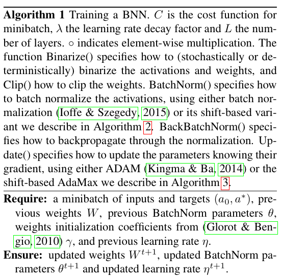
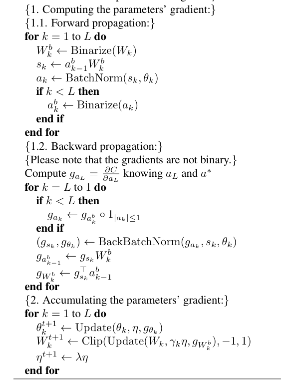
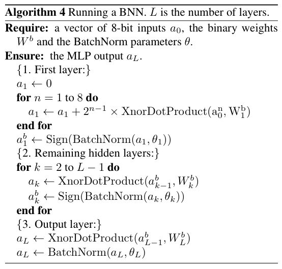
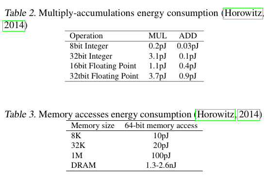
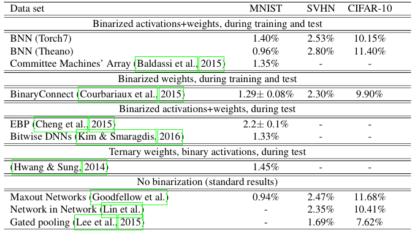

# 二值神经网络（Binary Neural Network，BNN）

在我刚刚过去的研究生毕设中，我在ImageNet数据集上验证了图像特征二值化后仍然具有很强的表达能力，可以在检索中达到较好的效果。而Bengio大神的这篇文章，则不止于将特征二值化，而是要将权重和每层的激活值统统二值化。相比于非二值化的网络，将大量的数学运算变成了位操作。这样就节省了大量的空间而前向传播的时间，使神经网络的应用门槛变得更低。

本文是阅读Bengio二值化网络文章的笔记，特此声明。

要想使整个神经网络二值化，那么最需要解决的问题就是反向传播时的求导。下面会通过一系列手段使的这个操作可行。

# BNN算法

## 二值化的手段

直觉上看，二值化的手段非常简单啊，整数是1，负数是-1就可以了。但实际上，这只是其中一种，即决定式的二值化。

还有一种是随机式的二值化。

> 这个样的公式让我想起跟一个大神聊天时谈到的问题，比如，在我之前Google点击率预估那篇博文中提到的一种网络压缩方法，即不适用32bit的浮点数而是使用16bit格式的数字。既然有压缩，那么就会遇到精度问题，比如如果压缩后的数值表示精度能到0.01，而更新的梯度的值没到这个精度，比如0.001，此时该如何更新这个值？

> 答案就是用一定的概率去更新这个值。

第二种方法虽然看起来比第一种更合理，但是在实现时却有一个问题，那就是每次生成随机数会非常耗时，所以一般使用第一种方法。

## 梯度计算和累加

虽然`BNN`的参数和各层的激活值是二值化的，但由于两个原因，导致梯度不得不用较高精度的实数而不是二值进行存储。两个原因如下：

- 梯度的值的量级很小
- 梯度具有累加效果，即梯度都带有一定的噪音，而噪音一般认为是服从正态分布的，所以，多次累加梯度才能把噪音平均消耗掉。

另一方面，二值化相当于给权重和激活值添加了噪声，而这样的噪声具有正则化作用，可以防止模型过拟合。所以，二值化也可以被看做是Dropout的一种变形，Dropout是将激活值的一般变成0，从而造成一定的稀疏性，而二值化则是将另一半变成1，从而可以看做是进一步的dropout。

> 在我之前的研究生论文中，在做图像检索时，也将dropout后的特征向量二值化后进行对比过，检索上的Loss不大。

## 离散化梯度传播

直接对决定式的二值化函数求导的话，那么求导后的值都是0。所以只能采用一种妥协方法，将sign(x)进行宽松。这样，函数就变成可以求导的了。

假设，损失函数是C，二值化操作函数如下：

如果C对q求导已经得到了，那么C对r的求导计算公式如下：

其中1|r|<=1的计算公式就是Htanh。

在具体的算法使用中，对于隐含层单元：

- 直接使用决定式的二值化函数得到二值化的激活值。
- 对于权重，
	- 在进行参数更新时，要时时刻刻把超出[-1,1]的部分给裁剪了。即权重参数始终是[-1,1]之间的实数。
	- 在使用参数是，要将参数进行二值化。
	
## BNN的训练过程

前面的几条技巧，就可以解决求导的问题了。普通卷积神经网络加上BatchNormalization再加上二值化后的模型训练流程如下：

其实基本流程不难理解，不过猜测实现上还是有很多坑。

# 优化技巧

## Shift based Batch Normalization

Batch Normalization，简称BN。所谓的BN是指在数据经过一层进入下一层之前，需要对数据进行归一化，使之均值为0，方差为1。这样可以使得各层的参数量级上没有太大的差别。

有三个优点：

- 加速训练
- 减小权重的值的尺度的影响
- 归一化所带来的噪声也有模型正则化的作用。

> 吐槽：貌似所有的带来效果收益的操作都是噪声所带来的正则化的功劳，正则化是个啥概念？我理解从几何上可以这样理解，NN其实就是在一个高维空间上构建了分类面，数据不变的情况下，这个分类面恰好贴合数据，完美fit训练集，而添加噪声后，相当于一些数据的位置不停的在变化，使得分类面发生了可包纳的数据量增加了，从而增加的泛化能力。说来说去好像是Data Augmentation的功劳。

但是，BN有一个缺点，那就是在训练时，因为要对数据进行scale，所以有很多矩阵乘法，导致训练时间过长。

因为二值化这一特殊情况，所以可以对BN进行优化，可以在不进行乘法的情况下近似计算BN，这就是shift-based Batch Normalization。

## Shift based AdaMax

Adam是一种学习规则，学习规则中最普通的就是SGD，关于Adam的原始论文我倒是还没有读过，且把shift based Adamax的算法列出来吧。

## 第一层

尽管所有的层次的激活和参数都是二值化的，但第一层的输入却是连续值的，因为是像素。若要整个网络都是二值化的，只需将输入变化一下即可。

使用8位数字来表示一个像素，那么输入就是一个img_height×img_width×8的向量，而权重参数是一个img_height×img_width的全1向量。

> 我注意到论文汇总用的是1024，实在不明白1024是怎么来的，但我注意到实验中使用的数据集cifar和SVNH都是32×32的，所以猜测可能作者写顺手了。

第一层的计算操作如下：

这个函数就把像素值还原回来了，xn的意思我理解是每个数都取第n位。这样累加之后，所有的像素值都被还原了。

这样，各层的计算方法如下：

# 性能分析

时间复杂度可以降低60%。

> 疑问，这个60%不知论文是怎么得到的。

- 内存和计算耗能
	- 内存访问耗时比计算耗时要多
	- 相对于32bit的DNN，BNN内存需求量减少为原来的1/32还少，使得能源使用减少31/32。
	

- XNOR-Count
	- BNN中计算都变成位运算，一个32bit的乘法损耗200个单位，而一个位操作之损耗1个单位。
	
- Filter数目
	- 二值化的不同的卷积核的个数由卷积核的大小决定，比如，3×3的卷积核的数目为29=512个。但是这并不能限制每一层feature_map的数目，因为，卷积核参数是用4D矩阵来存储的，即Ml×Ml-1×k×k，相当于第l-1层的每一个feature_map都对应512个不一样的filter，所以Filter数目的上限是2k×k×Ml-1个。
	- 对于卷积核来说，完全相反的卷积核也属于同一类，比如[-1,1,-1]和[1,-1,1]，因为，不同的卷积核的数目可以降低为原来的42%。
	
# 实现优化

- 对于位操作而言，可以使用SWAR中的SIMD并行化指令来进行加速。即将32个二值化变量存储在一个32位的寄存器中，从而获得32倍的加速。
- 神经网络的传播过程中，可以使用SWAR技术来使用3个指令计算32个Connection，如下，从而原先32个时间单元的事情现在（accumulation，popcount，xnor）=1+4+1=6个单元就可以完成，提升5.3倍
	
	
为了验证上述理论，实现了两个GPU计算核，一个是没有优化的乘法（baseline），一个是使用上面公式的SWAR技术实现的（XNOR）。结果如下：

- XNOR相对于baseline快23倍
- XNOR相对于cuBLAS快3.4倍

# 实验设置及结果

实验结果一言以蔽之，就是比最好的结果要稍差，但差的不会太多。

## Mnist

### 数据集
	60K 28×28的训练集
	10k 28×28的测试集。

### Theano设置

- 3个4096维的隐含层
- L2-SVM的输出层
- 使用Dropout
- ADAM学习法则
- 指数衰减的步长
- mini-batch为100的BN
- 训练集的最后10k样本作为验证集来early-stopping和模型选择
- 大概1000次迭代后模型最好，没有在验证集上重新训练。

### Torch7设置

与上面设置的区别：

- 没有dropout
- 隐含层数目变为2048
- 使用shift-based AdaMax和BN
- 每十次迭代步长一次右移位

## Cifar0

### 数据集
	
	50K 32×32的训练集
	10K 32×32的测试集
	
### Theano设置

- 没有任何的数据预处理
- 网络结构和Courbariaux 2015的结构一样，除了增加了binarization
- ADAM学习法则
- 步长指数损失
- 参数初始化来自Glorot & Bengio的工作
- mini-batch为50的BN
- 5000个样本作为验证集
- 500次迭代后得到最好效果，没有在验证集上重新训练

### Torch7设置

与上面设置的不同：

- 使用shift-based AdaMax和BN（mini-batch大小200）
- 每50次迭代，学习率右移一位。

## SVHN

### 数据集

	604K 32×32的训练集
	26K  32×32的测试集

### 设置

基本与cifar10的设置相同，区别如下：

- 卷积层只使用一半的单元。
- 训练200次迭代就停了，因为太大。

## 实验结果

# 总结

- 缺点：BNN在训练过程中仍然需要保存实数的参数，这是整个计算的瓶颈。

> 个人直观感受：
> 
> - BNN虽然需要保存实数的参数，但是实数范围是[-1,1]，所以可以做压缩，即使用16bit或者更少的位数来表示浮点数。
> - 模型尺寸变小，正向传播计算速度变快，意味着可以将正向传播层放到客户端去做了，虽然随着网络带宽的增大，给服务器传个图片也么啥。
> - 将图像的特征学习和哈希码学习可以无缝整合到一起，因为都是二值化。

> 暂时就这些！

	

# 参考文献

[1]. Hubara I, Soudry D, Yaniv R E. Binarized Neural Networks[J]. arXiv preprint arXiv:1602.02505, 2016.

[2]. 代码链接：[https://github.com/MatthieuCourbariaux/BinaryNet](https://github.com/MatthieuCourbariaux/BinaryNet)
