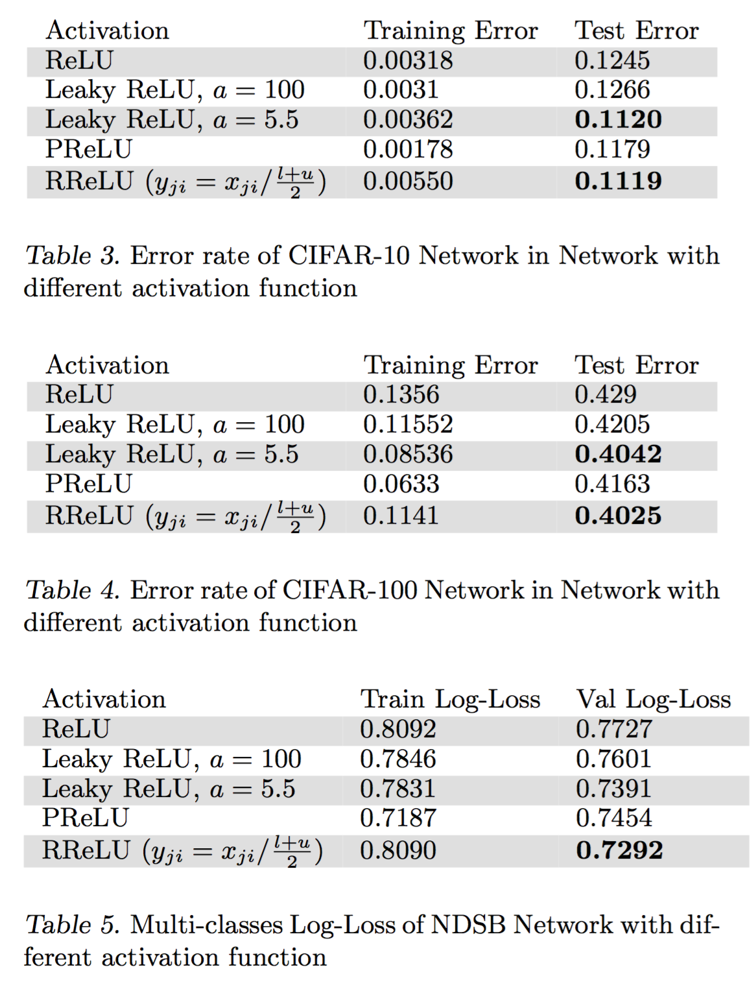

# ReLU上的花样

CNN出现以来，感觉在各个地方，即便是非常小的地方都有点可以挖掘。比如ReLU。

ReLU的有效性体现在两个方面：

- 克服梯度消失的问题
- 加快训练速度

而这两个方面是相辅相成的，因为克服了梯度消失问题，所以训练才会快。

[ReLU的起源](http://101.200.216.236/2016/01/07/relu/)，在这片博文里，对ReLU的起源的介绍已经很详细了，包括如何从生物神经衍生出来，如何与稀疏性进行关联等等。

其中有一段特别精彩的话我引用在下面：

> 几十年的机器学习发展中，我们形成了这样一个概念：非线性激活函数要比线性激活函数更加先进。

> 尤其是在布满Sigmoid函数的BP神经网络，布满径向基函数的SVM神经网络中，往往有这样的幻觉，非线性函数对非线性网络贡献巨大。

> 该幻觉在SVM中更加严重。核函数的形式并非完全是SVM能够处理非线性数据的主力功臣（支持向量充当着隐层角色）。

> 那么在深度网络中，对非线性的依赖程度就可以缩一缩。另外，在上一部分提到，稀疏特征并不需要网络具有很强的处理线性不可分机制。

> 综合以上两点，在深度学习模型中，使用简单、速度快的线性激活函数可能更为合适。

而本文要讲的，则是ReLU上的改进，所谓麻雀虽小，五脏俱全，ReLU虽小，但也是可以改进的。

# ReLU的种类

ReLU的区分主要在负数端，根据负数端斜率的不同来进行区分，大致如下图所示。

普通的ReLU负数端斜率是0，Leaky ReLU则是负数端有一个比较小的斜率，而PReLU则是在后向传播中学习到斜率。而Randomized Leaky ReLU则是使用一个均匀分布在训练的时候随机生成斜率，在测试的时候使用均值斜率来计算。

# 效果

其中，NDSB数据集是Kaggle的比赛，而RReLU正是在这次比赛中崭露头角的。

通过上述结果，可以看到四点：

- 对于leaky ReLU来说，如果斜率很小，那么与ReLU并没有大的不同，当斜率大一些时，效果就好很多。
- 在训练集上，PReLU往往能达到最小的错误率，说明PReLU容易过拟合。
- 在NSDB数据集上RReLU的提升比cifar10和cifar100上的提升更加明显，而NSDB数据集比较小，从而可以说明，RReLU在与过拟合的对抗中更加有效
- 对于RReLU来说，还需要研究一下随机化得斜率是怎样影响训练和测试过程的。

# 参考文献

[1]. Xu B, Wang N, Chen T, et al. Empirical evaluation of rectified activations in convolutional network[J]. arXiv preprint arXiv:1505.00853, 2015.