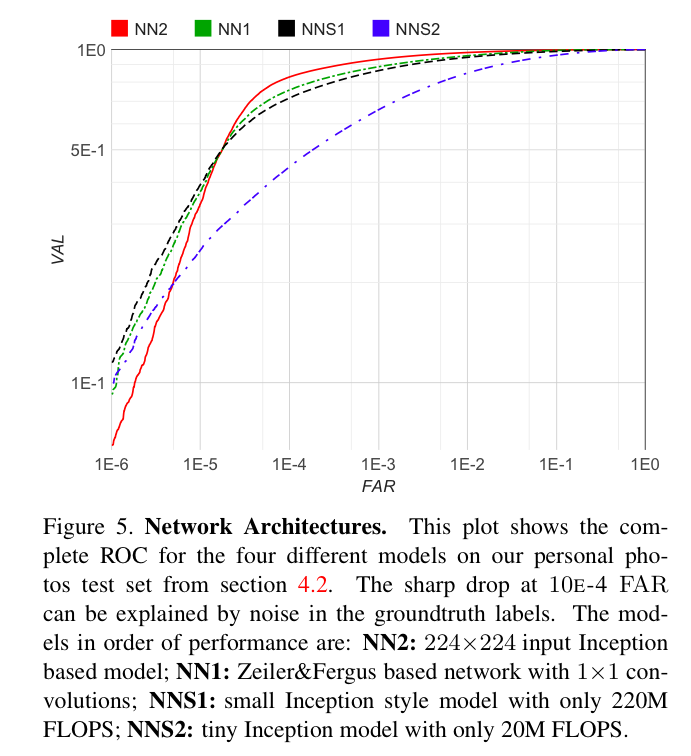
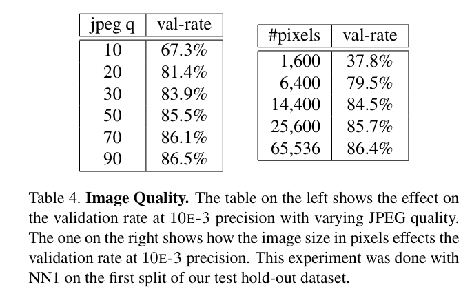
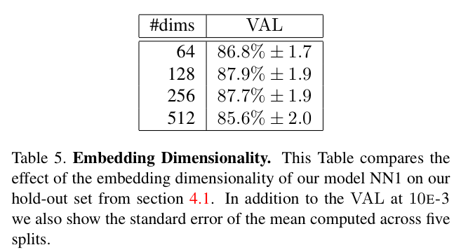
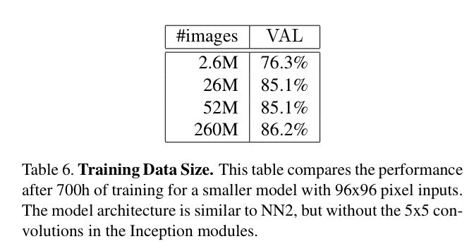

# FaceNet--Google的人脸识别

# 引入

随着深度学习的出现，CV领域突破很多，甚至掀起了一股CV界的创业浪潮，当次风口浪尖之时，Google岂能缺席。特贡献出FaceNet再次刷新LFW上人脸验证的效果记录。

# FaceNet

与其他的深度学习方法在人脸上的应用不同，FaceNet并没有用传统的softmax的方式去进行分类学习，然后抽取其中某一层作为特征，而是直接进行端对端学习一个从图像到欧式空间的编码方法，然后基于这个编码再做人脸识别、人脸验证和人脸聚类等。

FaceNet算法有如下要点：

- 去掉了最后的softmax，而是用元组计算距离的方式来进行模型的训练。使用这种方式学到的图像表示非常紧致，使用128位足矣。
- 元组的选择非常重要，选的好可以很快的收敛。

先看具体细节。

# 网络架构

大体架构与普通的卷积神经网络十分相似：

如图所示：Deep Architecture就是卷积神经网络去掉sofmax后的结构，经过L2的归一化，然后得到特征表示，基于这个特征表示计算三元组损失。

# 目标函数

在看FaceNet的目标函数前，其实要想一想DeepID2和DeepID2+算法，他们都添加了验证信号，但是是以加权的形式和softmax目标函数混合在一起。Google做的更多，直接替换了softmax。

所谓的三元组就是三个样例，如(anchor, pos, neg)，其中，x和p是同一类，x和n是不同类。那么学习的过程就是学到一种表示，对于尽可能多的三元组，使得anchor和pos的距离，小于anchor和neg的距离。即：

所以，变换一下，得到目标函数：

目标函数的含义就是对于不满足条件的三元组，进行优化；对于满足条件的三元组，就pass先不管。

# 三元组的选择

很少的数据就可以产生很多的三元组，如果三元组选的不得法，那么模型要很久很久才能收敛。因而，三元组的选择特别重要。

当然最暴力的方法就是对于每个样本，从所有样本中找出离他最近的反例和离它最远的正例，然后进行优化。这种方法有两个弊端：

- 耗时，基本上选三元组要比训练还要耗时了，且等着吧。
- 容易受不好的数据的主导，导致得到的模型会很差。

所以，为了解决上述问题，论文中提出了两种策略。

- 每N步线下在数据的子集上生成一些triplet
- 在线生成triplet，在每一个mini-batch中选择hard pos/neg 样例。

为了使mini-batch中生成的triplet合理，生成mini-batch的时候，保证每个mini-batch中每个人平均有40张图片。然后随机加一些反例进去。在生成triplet的时候，找出所有的anchor-pos对，然后对每个anchor-pos对找出其hard neg样本。这里，并不是严格的去找hard的anchor-pos对，找出所有的anchor-pos对训练的收敛速度也很快。

除了上述策略外，还可能会选择一些semi-hard的样例，所谓的semi-hard即不考虑alpha因素，即：

# 网络模型

论文使用了两种卷积模型：

- 第一种是Zeiler&Fergus架构，22层，140M参数，1.6billion FLOPS(FLOPS是什么？)。称之为NN1。
- 第二种是GoogleNet式的Inception模型。模型参数是第一个的20分之一，FLOPS是第一个的五分之一。
- 基于Inception模型，减小模型大小，形成两个小模型。
	- NNS1：26M参数，220M FLOPS。
	- NNS2：4.3M参数，20M FLOPS。
- NN3与NN4和NN2结构一样，但输入变小了。
	- NN2原始输入：224×224
	- NN3输入：160×160
	- NN4输入：96×96

其中，NNS模型可以在手机上运行。

其实网络模型的细节不用管，将其当做黑盒子就可以了。

# 数据和评测

在人脸识别领域，我一直认为数据的重要性很大，甚至强于模型，google的数据量自然不能小觑。其训练数据有100M-200M张图像，分布在8M个人上。

当然，google训练的模型在LFW和youtube Faces DB上也进行了评测。

下面说明了多种变量对最终效果的影响

## 网络结构的不同

## 图像质量的不同

## 最终生成向量表示的大小的不同

## 训练数据大小的不同

## 对齐与否

在LFW上，使用了两种模式：

- 直接取LFW图片的中间部分进行训练，效果98.87左右。
- 使用额外的人脸对齐工具，效果99.63左右，超过deepid。

# 总结

- 三元组的目标函数并不是这篇论文首创，我在之前的一些Hash索引的论文中也见过相似的应用。可见，并不是所有的学习特征的模型都必须用softmax。用其他的效果也会好。
- 三元组比softmax的优势在于
	- softmax不直接，（三元组直接优化距离），因而性能也不好。
	- softmax产生的特征表示向量都很大，一般超过1000维。
- FaceNet并没有像DeepFace和DeepID那样需要对齐。
- FaceNet得到最终表示后不用像DeepID那样需要再训练模型进行分类，直接计算距离就好了，简单而有效。
- 论文并未探讨二元对的有效性，直接使用的三元对。

	
# 参考文献

[1]. Schroff F, Kalenichenko D, Philbin J. Facenet: A unified embedding for face recognition and clustering[J]. arXiv preprint arXiv:1503.03832, 2015.

